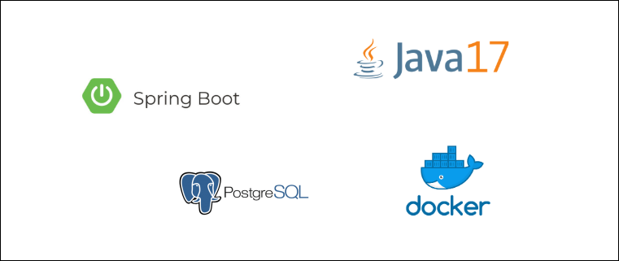

# MicroServiço - Gestão de TeleChamadas

Micro serviço responsável pela gestão de TeleChamadas

- Controle de TeleChamadas

Url de acesso: http://localhost:8095/api/v1

## Stack

- Java 17
- Spring Boot
- Docker
- PostgreSQL



## Iniciar testes unitários

Execução dos testes unitários. Necessário ter o utilitário make instalado. 

```shell
make api/test
```

## Iniciar ambiente dev/local

Inicia container e configura a aplicação. Necessário ter o utilitário make instalado e o docker estar em execução.

```shell
make dev/local
```

ou inicialização manual

```shell
docker-compose up -d
./mvnw spring-boot:run
```

## GIT
https://github.com/adriano-pinheiro/fase5-mstelecall


## Collection para importação no Postman
[telecall.postman_collection.json](externalfiles%2Ftelecall.postman_collection.json)


## Documentação API

- [Criar uma TeleChamada](docs/create.md)
- [Iniciar uma TeleChamada](docs/initialize.md)
- [Encerrar uma TeleChamada](docs/close.md)

## Swagger
http://localhost:8095/swagger-ui/index.html